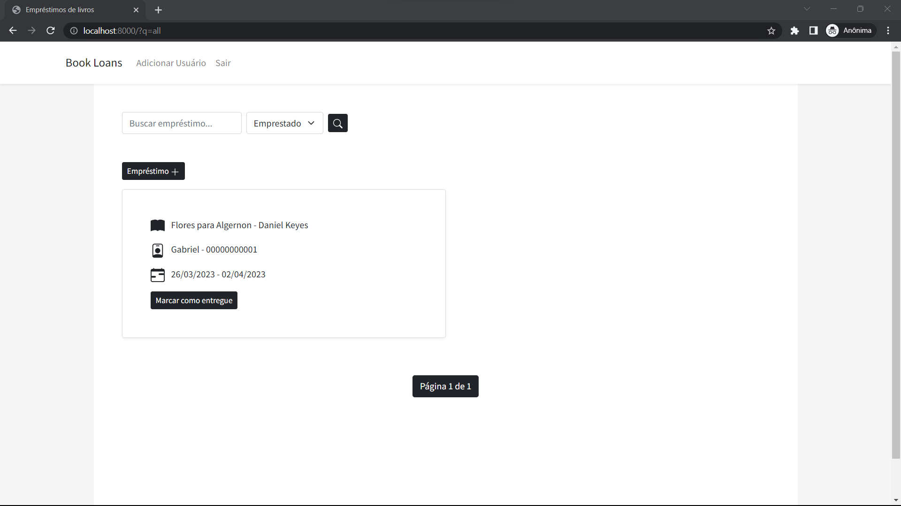

# Book Loan Manager

Django app to manage book borrowing.

## Screenshots

### Home page


## Goals

App developed in order to put into practice my studies on Django.  
Some of the concepts I was able to put into practice:

- Class based views
- ORM
- Forms
- Templates
- Basic auth
- Integration with third party lib

## Tools

[](https://www.djangoproject.com/)
[](https://getbootstrap.com/)

## Run locally

The first thing to do is to clone the repository:

```sh
git clone https://github.com/ogaaabriel/book_loan_manager.git
cd book_loan_manager
```

Create a virtual environment to install dependencies in and activate it:

```sh
python -m venv venv
source venv/Scripts/activate
```

Then install the dependencies:

```sh
pip install -r requirements.txt
```

Once `pip` has finished downloading the dependencies:

```sh
python manage.py migrate
python manage.py createsuperuser
python manage.py runserver
```

And navigate to `http://localhost:8000`.
